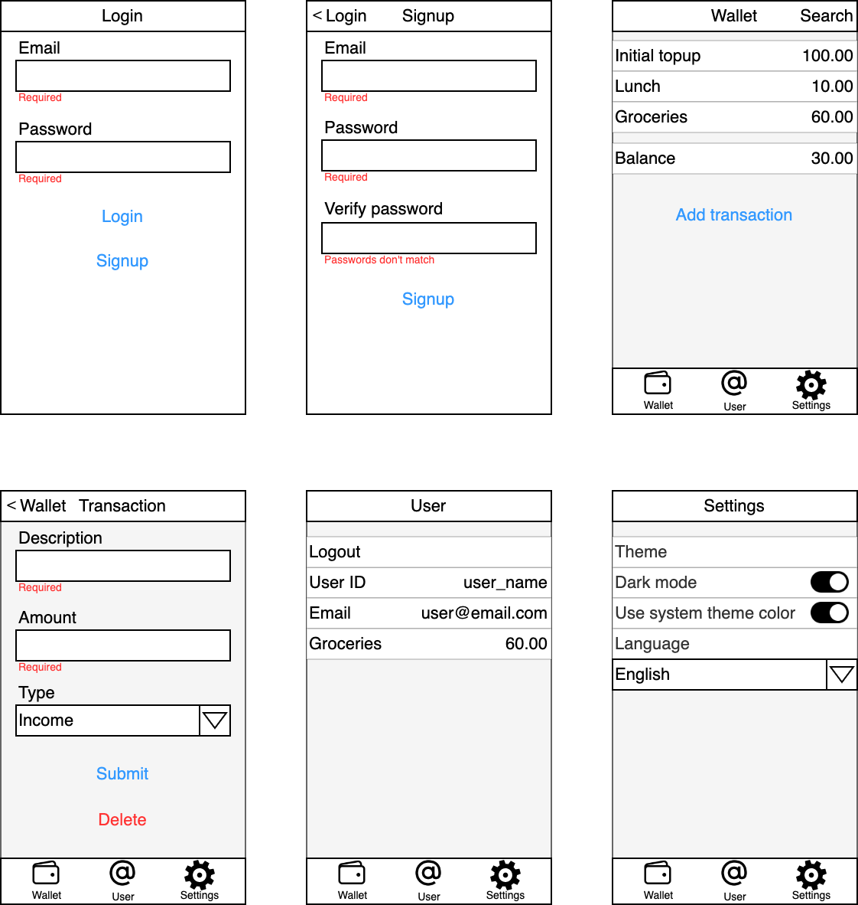

# CM3050 Mobile Development Final Project

## Introduction

This is a basic React Native application that allows the user to manage their petty cash. It has been built with Firebase as the backend which allowed me to quickly build the API and authentication.

The basic features of the application would be:

- Allow users to sign up, log in, and log out.
- Once logged in, the user should be able to add, edit, and delete petty cash entries
- On main screen, the user should be able to see a list of transactions in their wallet.

Some strech goals:

- Ability to select UI language for the app i.e. the app should have translations for some languages (e.g. English, French, Spanish, etc.)
- Allow users to search for transactions by keyword, date range, or type.
- Ability to attach a photo of an invoice to a transaction.

## Wireframes

The following wireframes show the basic design and functionality of the application. However, the actual implementation is a little bit improved version of this because I learned some new things along the way as I developed the application and therefore felt that certain earlier decisions I made were not quite right.



### User flow

The following points briefly describe the user flow of the application:

- When a user launches the app for the first time, they don't see any tabs and then can only navigate between login and signup pages.
- Upon signing up, the user is taken to login page.
- Upon logging in, the user is taken to the main screen which is the wallet page.
- In all forms, the user can submit form if the form is valid, however, if the form is invalid, the user is notified and form submission is stopped.
- Upon actions such as logout, delete transaction, user confirmation is requested and the action is performed if the user confirms.
- The user is also notified if an error occurs e.g. if login fails.

##### Navigation flow
- Unauthenticated user:
    - Login
    - Signup
- Authenticated user:
    - Wallet: for CRUD operations on petty cash entries.
        - Transaction screen (to add, edit, and delete petty cash entries)
    - User: for current user account information and logout.
        - User detail screen (to see current user account information)
    - Settings: for changing the theme and UI language of the application.

## User feeback

I was only able to get feedback from friends and family, either face to face or via video calls. Unfortunately, I had issues running the application via Expo Snack because Snackager fails to load firebase v9 JavaScript SDK ([GitHub Issue](https://github.com/expo/snack/issues/268)).

The following points outline the feedback I received:

- In some cases I didn't use spinners, so the users didn't know if a button press did anything.
- The app started in English language, it should default to the device language on first launch.
- The web based app hangs on when alert is displayed.
- The app needs to support a way to reset password.
- Some users wanted the ability to delete their account.
- The theme settings are confusing, it would be a lot simpler to have three options instead of two toggles: light, dark, and system.
- Some users requested the ability to manage multiple wallets.
- Users pointed out that the app doesn't indicate the type of currency.
- There are some missing translations e.g. in the alerts displayed to the user.

I fixed some of these issues, however I didn't have enough time in the end to implement e.g. theme settings improvement, ability to reset password, and ability to delete account.

## Prototyping

I did some early prototyping for the navigation flow on Expo Snack. I tried out React Router 6 native package however it lacks the basic UI components such as BottomTabsNavigator that React Navigation package provides. So I decided to use React Navigation.

I decided to use Firebase as backend because it requires minimal amount of time to have a basic API ready. I applied security rules to firestore to allow authenticated users to read and write only their own data. Once the data access rules worked as expected, I was confident enought to rely on Firebase as the backend.

Soon, I had issues with firebase not working on Snack, so I had to switch to offline development on my MacBook. While I initally used TypeScript, I decided to switch to JavaScript because I feared I might not be able to deploy the app as Expo Snack. I also decided against using React Native UI libraries other than `react-native-table-view-simple` due to possible issues with Expo Snack.

## Development

I mostly developed the app on MacOS using VS Code and Expo CLI. Developing on MacOS allowed me to test the app on iPhone emulator. Occasionally, I would have to test certain features using an actual device, e.g. I found out that system theme did not work on iPhone emulator but worked on actual device.

I used Eslint and Prettier in my application which allowed to me to keep the code consistent and clean.

Some of the notable programming and other techniques I used are:

- Organizing my code into a neat folder structure such as `components`, `contexts`, `navigation`, `screens`, `locales` and `utils`. Within `screens`
- Using React Context to share state between components thus avoiding "props drilling". Since the app is small, I didn't want to use Redux. Please see `contexts` folder to find authentication and theme contexts.
- Translations: I used `react-i18next` to translate the app. Please see `locales` folder to find the translations. To detect system language, I relied on a package called `i18next-react-native-language-detector`. Thus the app switches to system language on first launch however if the user changes the language, the app switches to the user's language.
- I used AsyncStorage to store to store certain user settings such as theme and language. I clear the AsyncStorage when the user logs out.
- Using `react-native-table-view-simple` keep the UI clean and "native" looking, especially on iOS.
- Having custom wrappers for form components that hook into Formik API to seamlessly manage form state and display validation errors. For validation, I used `yup` package.
- For backend, I used Firebase Auth and Firestore. I used the following security rule on firestore:

```js
rules_version = '2';
service cloud.firestore {
  match /databases/{database}/documents {
    match /{document=**} {
      allow read, write: if false;
    }
    match /users/{user} {
      allow read, write: if request.auth != null && request.auth.uid == user
      match /transactions/{transaction} {
        allow read, write: if request.auth != null && request.auth.uid == user
      }
    }
  }
}
```

While I really wanted to implement more features and improvements based on user feedback, I did not have enough time to do so. Therefore, I decided to spend the remaining time on testing and polishing the existing features.

## Testing

For automated testing, I used Jest and React Native Testing Library. These tests maybe be found in `components/__tests__/` folder. I wrote some decent tests for `TextInput` and `ButtonSelect` components. However the test coverage for the app as a whole is not satisfactory.

Some of the tests are snapshot tests but others test the behavior of the component based on some user actions.

# Evaluation

I unfortunately didn't have enough time to improve test coverage because some of the components as heavily coupled with the backend and it 


## Known issues

- There is a bug where sometimes the app doesn't immediately switch to dark mode upon tapping the toggle in settings. This issue can be reproduced on older iPhones such as iPhone 6s. I couldn't reproduce this on iPhone 13.